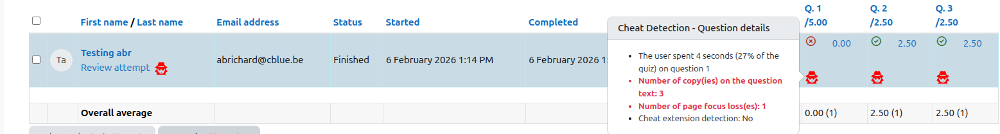
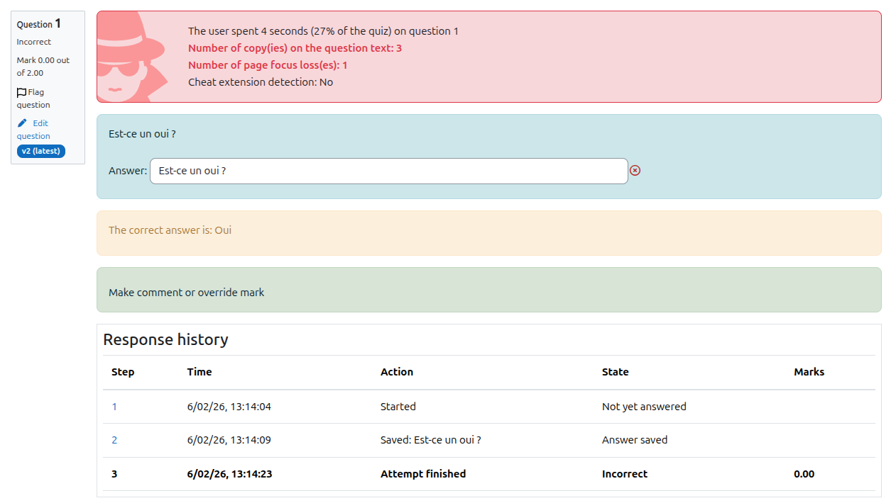

# Teacher Guide

## Enabling Cheat Detection

1. Create or edit a quiz.
2. Set "Questions per page" to 1.
3. Save.

Monitoring is automatically enabled.

---

## Viewing Behavioral Data

During quiz review, teachers can see:

- Time spent per question
- Percentage of total attempt
- Copy attempts
- Focus loss count
- Extension detection
- Suspicious event summary

---

## Interpreting Results

High focus loss may indicate tab switching.

Copy attempts indicate text selection copying.

These indicators must be interpreted carefully and should not be used as sole evidence of cheating.
